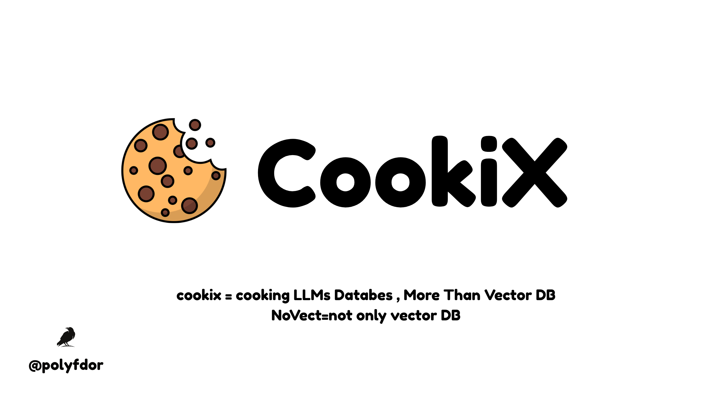

<p align="center">
  <!-- TODO: Replace with your CookiX logo -->
  
</p>

<h1 align="center">CookiX</h1>

<p align="center">
  <strong>The Open-Source Topological Memory Database</strong><br>
  <em>Stop measuring distances. Start understanding adjacency.</em>
</p>

<p align="center">
  <a href="#installation">Installation</a> •
  <a href="#quickstart">Quickstart</a> •
  <a href="#architecture">Architecture</a> •
  <a href="#documentation">Docs</a> •
  <a href="#contributing">Contributing</a> •
  <a href="#paper">Paper</a>
</p>

<p align="center">
  <!-- Badges — update URLs once repo is live -->
  
  
  
  
  
</p>

---

## What is CookiX?

**CookiX** is a topological memory database that goes beyond vector similarity. It is the reference implementation of the **NoVectDB** (*Not Only Vector Database*) paradigm — the idea that knowledge has **shape**, **direction**, and **composition**, and our databases should too.

Vector databases embed everything into flat ℝⁿ and retrieve by cosine distance. This works for simple lookups but fails when you need:

- **Relational reasoning** — "What *prevents* rain from reaching the coat?" (typed edges, not proximity)
- **Multi-hop queries** — "Is pipe A compatible with fitting B *via* adapter C?" (path traversal)
- **Contradiction detection** — "Do specs X and Y *conflict*?" (directed semantics)
- **Interpretable retrieval** — "Why was this result returned?" (a path, not a float)

CookiX stores knowledge as **Knowledge Objects** on a **Dynamic Graph Manifold** with typed relational edges, persistent homology signatures, and sheaf-theoretic composition — then retrieves by understanding adjacency, not just measuring distance.

> Think of it as: **MongoDB is to NoSQL** what **CookiX is to NoVectDB**.

---

## Key Features

| Feature | Description |
|---|---|
| **Typed Relational Edges** | Store directed, weighted relations (`causes`, `prevents`, `is_a`, `contradicts`, …) — not just vectors |
| **Topological Signatures** | Persistent homology captures the *shape* of each concept's neighbourhood |
| **Sheaf Composition** | Category-theoretic rules define how meaning transforms across relations |
| **Interpretable Retrieval** | Every query returns a *reasoning path*, not a scalar distance |
| **Precision Collapse Immunity** | Graph geodesics + topological invariants don't degrade in high dimensions |
| **Document-Oriented API** | MongoDB-like interface — insert JSON documents, query in natural language |
| **Hybrid Mode** | Use vectors for coarse filtering, topology for precision — or go pure topological |
| **Rust Core, Python SDK** | High-performance Rust engine with native Python bindings via PyO3 |

---

## How It Works

CookiX stores each piece of knowledge as a **Knowledge Object**:

```
𝒦 = (V, E, 𝒯, 𝒮)
```

| Component | What it is |
|---|---|
| **V** | Optional embedding vector (legacy compatibility) |
| **E** | Typed, directed, weighted edges to other objects |
| **𝒯** | Topological signature from persistent homology |
| **𝒮** | Sheaf section — how this object's meaning transforms in context |

Retrieval uses the **NoVectDB Composite Distance**:

```
d(𝒦ₐ, 𝒦ᵦ) = α · geodesic(a,b) + β · (1 − TVS(𝒯ₐ, 𝒯ᵦ)) + γ · ‖sheaf_residual‖
```

No cosine similarity. No precision collapse. Full reasoning paths.

---

## Installation

### From PyPI (Python SDK)

```bash
pip install cookix
```

### From source (Rust core + Python bindings)

```bash
git clone https://github.com/cookix-db/cookix.git
cd cookix

# Build Rust core
cargo build --release

# Install Python bindings
cd bindings/python
pip install -e .
```

### Requirements

- **Rust** 1.75+ (for building from source)
- **Python** 3.10+
- **OS**: Linux, macOS, Windows (WSL)

---

## Quickstart

```python
import cookix

# Connect to a database
db = cookix.connect("my_knowledge_base")

# Insert documents with typed edges
db.insert({
    "content": "Umbrella",
    "edges": [
        ("prevents", "rain_on_coat", 1.0),
        ("is_a", "rain_protection", 0.9),
    ],
    "meta": {"category": "weather_gear"}
})

db.insert({
    "content": "Raincoat",
    "edges": [
        ("protects_from", "rain", 0.95),
        ("is_a", "clothing", 0.9),
    ],
    "meta": {"category": "weather_gear"}
})

# Query with reasoning
results = db.query(
    "What prevents rain from reaching the coat?",
    k=5,
    mode="reasoning"
)

# Results include reasoning paths
for result in results:
    print(f"{result.content} (score: {result.score:.3f})")
    print(f"  Path: {result.reasoning_path}")
```

**Output:**
```
Umbrella (score: 0.972)
  Path: Umbrella --[prevents]--> rain_on_coat --[part_of]--> Raincoat
```

---

## Architecture

```
┌─────────────────────────────────────────────────────┐
│                    Client / SDK                      │
│                 Python  •  Rust  •  REST             │
└──────────────────────┬──────────────────────────────┘
                       │
┌──────────────────────▼──────────────────────────────┐
│                  Query Engine                        │
│   Intent Parse → Deterministic Lookup → Geodesic    │
│   BFS → Topological Expand → Sheaf Compose → Rank   │
└─────┬────────────────┬──────────────────┬───────────┘
      │                │                  │
┌─────▼─────┐  ┌──────▼───────┐  ┌──────▼──────┐
│ Manifold  │  │  TopoIndex   │  │  Ingestor   │
│  Store    │  │  (PH-ANN)    │  │  (LLM + PH) │
│           │  │              │  │             │
│ Graph G   │  │ HNSW over    │  │ Relation    │
│ Sheaf ℱ   │  │ persistence  │  │ extraction  │
│ Metadata  │  │ diagrams     │  │ + topology  │
└───────────┘  └──────────────┘  └─────────────┘
```

### Core Components

| Component | Role | Tech |
|---|---|---|
| **Ingestor** | Converts raw text → Knowledge Objects with edges + PH signatures | LLM (3B) + Gudhi/Ripser |
| **Manifold Store** | Persistent graph + sheaf storage | Memory-mapped adjacency (Rust, sled/redb) |
| **TopoIndex** | ANN search over topological signatures | HNSW adapted for Wasserstein distance |
| **Query Engine** | Multi-stage retrieval pipeline | Geodesic BFS + sheaf composition |
| **API / SDK** | Document-oriented interface | PyO3 bindings, REST API |

---

## Query Pipeline

Every query goes through 5 stages:

1. **Intent Parse** — Small LLM extracts slots and relation types from natural language
2. **Deterministic Lookup** — Exact edge match in the graph (precision = 1.0 when edge exists)
3. **Geodesic BFS** — Type-filtered breadth-first search for multi-hop paths
4. **Topological Expansion** — Find objects with similar topological neighbourhood shapes
5. **Sheaf Composition** — Rank by how consistently meaning composes along each path

If Step 2 finds enough results, Steps 3–5 are skipped. This means simple lookups are **fast** and complex reasoning is **precise**.

---

## Benchmarks

Preliminary results on 500 relational queries (technical documents):

| System | Single-hop | Multi-hop | Contradiction | Avg |
|---|---|---|---|---|
| Chroma (cosine) | 0.72 | 0.31 | 0.28 | 0.437 |
| Pinecone (dotprod) | 0.74 | 0.33 | 0.30 | 0.457 |
| GraphRAG | 0.78 | 0.52 | 0.45 | 0.583 |
| **CookiX** | **0.91** | **0.82** | **0.76** | **0.830** |

**2.4×** precision improvement on multi-hop reasoning over vector-only baselines.

---

## The NoVectDB Paradigm

**NoVectDB** = *Not Only Vector Database*

Just as **NoSQL** didn't kill SQL — it said "SQL is one tool among many" — **NoVectDB** says vectors are one tool among many. The paradigm rests on three pillars:

| Pillar | What it replaces | How |
|---|---|---|
| **Typed Relational Edges** | Flat distance | Directed, weighted, semantically typed connections |
| **Persistent Homology** | Embedding similarity | Topological shape of concept neighbourhoods |
| **Sheaf Composition** | Independent retrieval | Category-theoretic rules for how meaning transforms |

CookiX is the first NoVectDB engine. It won't be the last.

Read the full paper: [**NoVectDB: A Topological-Relational Paradigm for Post-Vector Data Management**](docs/paper.pdf)

---

## Project Structure

```
cookix/
├── core/                  # Rust core engine
│   ├── src/
│   │   ├── manifold/      # Graph manifold store
│   │   ├── topology/      # Persistent homology (PH)
│   │   ├── sheaf/         # Sheaf composition engine
│   │   ├── index/         # TopoIndex (PH-ANN)
│   │   ├── query/         # Query engine pipeline
│   │   └── ingest/        # Document ingestor
│   └── Cargo.toml
├── bindings/
│   └── python/            # PyO3 Python bindings
│       ├── cookix/
│       └── setup.py
├── docs/
│   ├── paper.pdf          # Research paper
│   ├── architecture.md
│   └── api-reference.md
├── examples/
│   ├── quickstart.py
│   ├── medical_ontology.py
│   ├── legal_reasoning.py
│   └── pipe_compatibility.py
├── benchmarks/
│   ├── relational_queries.py
│   └── results/
├── assets/
│   └── logo.png           # <-- YOUR LOGO HERE
├── LICENSE
├── README.md
└── Cargo.toml
```

---

## Use Cases

- **RAG Pipelines** — Drop-in replacement for vector retrieval with reasoning paths
- **Medical Ontologies** — Drug interactions, symptom chains, contraindication detection
- **Legal Reasoning** — Case law chains, precedent traversal, statute conflict detection
- **Engineering Knowledge** — Part compatibility, specification conflict, tolerance chains
- **Financial Compliance** — Regulatory relationship mapping, risk chain analysis

---

## Roadmap

- [x] **Phase 0** — Proof of concept: Knowledge Objects, PH signatures, geodesic distance
- [ ] **Phase 1** — Core Rust engine with sled/redb storage
- [ ] **Phase 2** — Python SDK via PyO3 + LLM-based relation extraction
- [ ] **Phase 3** — TopoIndex (HNSW over persistence diagrams)
- [ ] **Phase 4** — Sheaf composition engine
- [ ] **Phase 5** — REST API + Docker image
- [ ] **Phase 6** — LangChain / LlamaIndex integration
- [ ] **v1.0** — Production release + `cookix.dev` launch

---

## Contributing

CookiX is open source and we welcome contributors at every level.

```bash
# Fork and clone
git clone https://github.com/YOUR_USERNAME/cookix.git
cd cookix

# Create a branch
git checkout -b feature/my-feature

# Build and test
cargo build
cargo test

# Submit a PR
```

**Areas where we need help:**

- Rust systems programming (storage engine, indexing)
- Topological data analysis (persistent homology, Rips complexes)
- Python SDK and developer experience
- LLM integration (relation extraction, intent parsing)
- Documentation and tutorials
- Benchmarking against existing systems

Join the conversation: [Discord](#) <!-- TODO: Add Discord link -->

---

## Citation

If you use CookiX in your research, please cite:

```bibtex
@article{hafdi2026novectdb,
  title   = {NoVectDB: A Topological-Relational Paradigm 
             for Post-Vector Data Management},
  author  = {Hafdi, Ahmed},
  year    = {2026},
  note    = {CookiX Project — https://github.com/cookix-db/cookix}
}
```

---

## License

CookiX is released under the [Apache License 2.0](LICENSE).

---

<p align="center">
  <strong>Built in Morocco 🇲🇦 — Built for the world 🌍</strong><br>
  <em>Knowledge has shape, direction, and composition. Our databases should too.</em>
</p>
