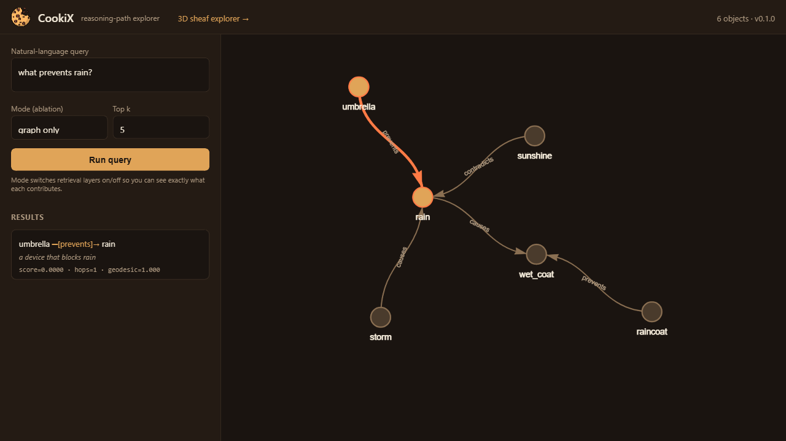
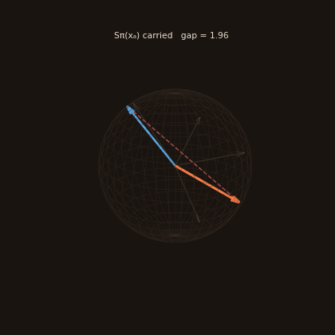
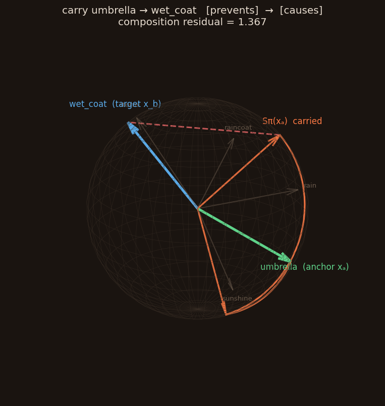

<p align="center">
  
</p>

<h1 align="center">CookiX</h1>

<p align="center">
  <strong>The open-source topological-relational memory database</strong><br>
  <em>Stop measuring distances. Start understanding adjacency.</em>
</p>

<p align="center">
  <a href="#installation">Installation</a> •
  <a href="#quickstart">Quickstart</a> •
  <a href="#how-it-works">How it works</a> •
  <a href="#the-honest-status">Honest status</a> •
  <a href="#benchmarks">Benchmarks</a> •
  <a href="#roadmap">Roadmap</a> •
  <a href="#contributing">Contributing</a>
</p>

<p align="center">
  
  
  
  
</p>

---

## What is CookiX?

**CookiX** is the reference implementation of the **NoVectDB** (*Not Only Vector Database*) paradigm: the idea that knowledge has **shape**, **direction**, and **composition**, and our databases should too.

Vector databases embed everything into flat ℝⁿ and retrieve by cosine distance. That works for fuzzy lookups but breaks down when you need:

- **Relational reasoning** — "What *prevents* rain from reaching the coat?" (a typed, directed edge — not proximity)
- **Multi-hop queries** — "Is pipe A compatible with fitting B *via* adapter C?" (path traversal)
- **Contradiction detection** — "Do specs X and Y *conflict*?" (directed semantics)
- **Interpretable retrieval** — "*Why* was this result returned?" (a reasoning path, not a float)

CookiX stores knowledge as **Knowledge Objects** in a typed, directed graph and retrieves by traversing relations — returning the *path* that justifies each answer.

> **MongoDB is to NoSQL** what **CookiX is to NoVectDB.**

---

## Installation

```bash
pip install cookix                 # core (graph traversal, zero heavy deps)
pip install "cookix[topology]"     # + persistent-homology re-ranking
pip install "cookix[kuzu]"         # + durable embedded graph storage
pip install "cookix[llm]"          # + LLM relation extraction
pip install "cookix[server]"       # + HTTP server & reasoning-path explorer UI
pip install "cookix[all]"          # everything
```

Requires Python 3.10+.

---

## Quickstart

```python
import cookix

db = cookix.connect("demo")

db.insert({"_id": "umbrella", "content": "blocks rain", "edges": [("prevents", "rain")]})
db.insert({"_id": "rain",     "content": "falling water", "edges": [("causes", "wet_coat")]})
db.insert({"_id": "wet_coat", "content": "a soaked coat"})

# Multi-hop reasoning — returns the path, not a distance
for r in db.query(anchor="umbrella", target="wet_coat", mode="reasoning"):
    print(r.explain())
# umbrella --[prevents]--> rain --[causes]--> wet_coat  (score=..., hops=2)
```

Try the built-in demos:

```bash
cookix demo umbrella
cookix demo pipe
cookix info          # shows which optional layers are active
```

---

## The reasoning-path explorer

A vector database can only show you a blob and a distance. CookiX can show you **why** — the typed path that justifies each answer, as an interactive graph.

<p align="center">
  
</p>

```bash
pip install "cookix[server]"
cookix serve                 # opens an HTTP API + UI at http://127.0.0.1:8000
cookix serve --demo pipe     # start from the pipe-compatibility demo
```

Open the browser UI, type a natural-language query (e.g. *"what prevents rain?"*), and the matching reasoning path lights up on the graph. Switch the **ablation mode** in the UI to see exactly what the topology and sheaf layers add on top of pure graph traversal.

### 3D sheaf explorer

The UI also includes a **3D sheaf explorer** (linked from the top bar, or `/sheaf`). At `dim=3`, every object's sheaf stalk is a unit vector on the sphere and every relation is a rotation of it. Pick an anchor and a target, and watch the anchor's "meaning" get *carried* through each relation on the reasoning path — the gap between where it lands and the target's stalk **is** the composition residual. A coherent chain lands near the target; an incoherent one drifts away.

<p align="center">
  
  &nbsp;&nbsp;
  
</p>

> Honest note: the restriction maps are currently random placeholders, so residuals are large by design (the trace above lands far from the target). The explorer is built to make that visible — when learned maps arrive, you'll *see* meaning start to compose.

The server also exposes the database over HTTP for non-Python clients:

```bash
curl -X POST http://127.0.0.1:8000/api/query \
  -H "Content-Type: application/json" \
  -d '{"query": "what prevents rain?", "mode": "reasoning"}'
```

---

## How it works

Each piece of knowledge is a **Knowledge Object** `K = (V, E, 𝒯, 𝒮)`:

| Component | What it is | Status |
|---|---|---|
| **V** | Optional embedding vector (legacy compatibility) | stable |
| **E** | Typed, directed, weighted edges (`causes`, `prevents`, `is_a`, …) | **stable — the proven core** |
| **𝒯** | Topological signature from persistent homology | experimental |
| **𝒮** | Sheaf section — how meaning transforms across a relation | experimental |

Retrieval runs a multi-stage pipeline (paper Algorithm 1):

1. **Deterministic lookup** — exact typed-edge match (precision 1.0 for single-hop).
2. **Geodesic BFS** — type-filtered, weighted shortest-path traversal for multi-hop.
3. **Topological re-ranking** — by similarity of persistent-homology signatures *(optional)*.
4. **Sheaf composition** — by how consistently meaning composes along each path *(optional)*.

The composite distance:

```
d(Kₐ, Kᵦ) = α · geodesic(a,b) + β · (1 − TVS(𝒯ₐ, 𝒯ᵦ)) + γ · ‖sheaf_residual‖
```

Every layer is **ablatable** via `mode=`:

```python
db.query(anchor="a", target="b", mode="graph")     # traversal only (baseline)
db.query(anchor="a", target="b", mode="topo")      # + topology
db.query(anchor="a", target="b", mode="sheaf")     # + sheaf
db.query(anchor="a", target="b", mode="reasoning") # full pipeline
```

### Durable storage and topological indexing

The engine depends only on a small `StorageBackend` contract, so the store is
swappable. Three backends ship with **behavioural parity** (a shared test battery
runs against them): the default in-memory NetworkX store, a **crash-safe durable**
store (pure Python), and a durable embedded **Kùzu** property-graph store.

```python
db = cookix.connect("graph.kuzu", backend="kuzu")        # embedded property graph
db = cookix.connect("data/mydb", backend="durable")      # WAL + atomic snapshots
```

**Durability you can rely on.** The `durable` backend gives a production database
the guarantees a volatile store cannot:

- **Write-ahead log** — every mutation is `fsync`'d to an append-only log before
  it is acknowledged, and the log is **torn-write tolerant** (a half-written tail
  from a crash is detected by a per-record CRC and dropped on replay, recovering
  to the last fully-durable record).
- **Atomic snapshots** — folding the WAL into a snapshot is a temp-file +
  `os.replace`, so a crash mid-snapshot can never corrupt the previous good one.
- **Atomic transactions** — `with db.transaction(): …` is an all-or-nothing write
  batch committed with a single `fsync`; an error in the block rolls back and
  writes nothing.
- **Thread-safe** — a re-entrant lock serialises writers (single-writer,
  multi-reader); concurrent writes cannot interleave into a corrupt graph or log.
- **Backup / restore** — point-in-time snapshot to a file and rebuild from it.

These are covered by a crash-recovery, atomic-rollback, concurrency-stress and
backup/restore test battery.

For shape-based retrieval at scale, `TopoIndex` provides approximate
nearest-neighbour search over persistence signatures via cosine LSH — sublinear
TVS lookup, deterministic, with an exact fallback and a built-in recall measure.

### Running the server in production

The embedded library is the trusted interface; the HTTP server (`cookix serve`)
adds **opt-in** operational controls for networked deployment (all off by default
so the demo just works). See [SECURITY.md](SECURITY.md) for the full threat model.

```bash
cookix serve --api-key "$KEY" --rate-limit 600   # auth + 600 req/min/client
# or via env: COOKIX_API_KEY, COOKIX_RATE_LIMIT_RPM, COOKIX_MAX_K,
#             COOKIX_MAX_HOPS, COOKIX_MAX_BODY_BYTES, COOKIX_READ_ONLY
```

- **Auth + roles** — API keys (`Authorization: Bearer` / `X-API-Key`), constant-time
  compared, each mapped to a role: `read` < `write` < `admin`. Reads need `read`,
  inserts need `write` (`403` on insufficient role). Set `COOKIX_API_KEYS="k1:read,k2:write"`.
- **Secure by default** — `serve` **refuses** to bind a non-loopback interface
  without auth (override with `--insecure` / `COOKIX_ALLOW_INSECURE=1`).
- **Rate limiting** — per-client fixed window → `429` with `Retry-After`.
- **Resource limits** — `k`/`max_hops` clamped, request body capped (`413`).
- **Read-only mode** — reject mutations (`403`) to serve a frozen database.
- **Observability** — `/healthz`, `/readyz`, Prometheus `/metrics`, JSON access logs.

A hardened, non-root [`Dockerfile`](Dockerfile) (with a `/healthz` HEALTHCHECK)
ships in the repo: `docker build -t cookix . && docker run -p 8000:8000 cookix`.

Talk to a running server from another process with the dependency-free typed
client over the stable wire API (see [API_STABILITY.md](API_STABILITY.md)):

```python
from cookix import CookixClient

db = CookixClient("http://localhost:8000", api_key="…")
db.insert({"_id": "umbrella", "content": "umbrella", "edges": [("prevents", "rain")]})
for r in db.query("what prevents rain?"):
    print(r["explain"])
```

---

## What 1.0 is — and is not

CookiX `1.0` is a **production-ready single-node** topological-relational
database. Calling it 1.0 is a scoped, honest claim — here is exactly what that
does and does not mean.

**What 1.0 delivers (validated and tested — 120 tests):**

- ✅ **A relational engine that beats strong baselines on real data.** On
  2WikiMultiHopQA, typed multi-hop traversal reaches **hits@10 0.58 vs Okapi
  BM25's 0.39** (+50% relative) under oracle entity-linking — measured on data
  CookiX did not design. See [Benchmarks](#benchmarks).
- ✅ **Durability.** A crash-safe backend: write-ahead log, atomic snapshots,
  atomic transactions, thread-safe concurrency, backup/restore — proven by a
  crash-recovery and concurrency-stress battery.
- ✅ **Deployability & security.** API-key auth, rate limiting, resource limits,
  read-only mode, metrics + health probes, a documented threat model, a hardened
  Dockerfile.
- ✅ **Predictable performance.** Query latency stays ~2 ms from 1k→50k objects
  (settle-once Dijkstra; pure Python, single node).
- ✅ **Stable distribution.** Versioned Python + wire + on-disk APIs, a typed
  client, and a wheel that builds, passes `twine check`, and installs cleanly.

**What 1.0 deliberately does *not* claim (no overselling):**

- 🚫 **Not distributed.** 1.0 is single-node — no clustering, sharding, or
  replication. That is post-1.0.
- 🧪 **The topological (𝒯) and sheaf (𝒮) layers are still open research bets.**
  They remain *optional and ablatable*; we have **not** shown they improve
  retrieval, and 1.0 does not depend on them. The sheaf maps are learnable
  (`cookix.sheaf.set_learned_maps`, ~50–60% held-out residual drop), but that is
  a property of the maps, not a proven retrieval win.
- ⏳ **The Rust hot-path core is post-1.0.** It is a performance optimization, not
  a correctness or safety requirement; the pure-Python engine is fast enough for
  1.0's single-node target. (No Rust toolchain was available to build it here.)
- ⏳ **End-to-end open-domain QA is extraction-limited.** The engine result above
  is under oracle entity-linking; free-text triple extraction (`cookix eval
  --extraction`) is the measured bottleneck and the honest frontier.

If the exotic layers don't earn their keep in honest ablations, we'll say so.
That's the point.

---

## Benchmarks

CookiX ships a **deterministic, reproducible** evaluation suite. One seed fixes the
corpus, the baselines, and every reported number:

```bash
cookix eval                       # Markdown table (defaults: seed=0, 40 worlds, k=5)
cookix eval --worlds 80 --json    # machine-readable
```

The corpus is a **steelman, not a strawman**: every entity's text describes the
entity *itself* (never its relations), and entities in a world share a topical
adjective — so a content/vector retriever genuinely retrieves the right
*neighbourhood*. The relational answer lives **only** in the typed edges, so
recovering it requires traversal, not proximity. All retrievers see the same
natural-language query and are scored identically.

Baselines: a **random** no-skill floor, and **`lexical-tfidf`** — TF-IDF cosine
over content, standing in for the vector-similarity family (a dense embedder
plugs into the same interface and behaves the same way with respect to
*relations*: it retrieves by topical proximity, not traversal).

`seed=0`, 40 worlds (240 documents, 160 queries spanning single-hop forward,
single-hop inverse, multi-hop, and contradiction), `k=5`:

| retriever | hits@1 | hits@5 | precision@5 | recall@5 | mrr | path_acc |
|---|---|---|---|---|---|---|
| random | 0.006 | 0.019 | 0.004 | 0.019 | 0.010 | 0.000 |
| lexical-tfidf | 0.250 | 0.750 | 0.150 | 0.750 | 0.375 | 0.000 |
| cookix-graph | 1.000 | 1.000 | 0.200 | 1.000 | 1.000 | 1.000 |
| cookix-topo | 1.000 | 1.000 | 0.200 | 1.000 | 1.000 | 1.000 |
| cookix-sheaf | 1.000 | 1.000 | 0.200 | 1.000 | 1.000 | 1.000 |
| cookix-reasoning | 1.000 | 1.000 | 0.200 | 1.000 | 1.000 | 1.000 |

Reading the numbers honestly:

- **The lexical baseline is real, not a punching bag.** It reaches `recall@5 = 0.75`
  because the shared adjective lets it pull the correct world's neighbourhood. But
  its `hits@1` is only `0.25` — it cannot pick the relationally-correct entity out
  of that neighbourhood, and its `path_acc` is **0** because content similarity
  structurally cannot produce a reasoning path.
- **CookiX recovers the exact relational target and the gold path** on this corpus,
  which is what the typed-graph core is built to do.
- **`topo`/`sheaf`/`reasoning` match `graph` here** — on a corpus this clean the
  graph core already saturates, so the exotic layers have no headroom to
  demonstrate. Their value has to be shown on harder, noisier data; that's exactly
  why they remain *ablatable*. We are not claiming 𝒯/𝒮 help yet.

### External validation: 2WikiMultiHopQA

The synthetic numbers prove the claim on a corpus CookiX designed. The harder
question — does it hold on data CookiX *didn't* design? — is now answered on
**2WikiMultiHopQA**, a standard multi-hop QA benchmark. It is uniquely suited
because each example ships **gold `(subject, relation, object)` evidence
triples**, which lets us measure the *relational engine* in isolation from the
known extraction bottleneck.

```bash
cookix eval --dataset 2wiki --path dev.json --k 10   # full reproducible run
```

We build one **global knowledge graph** from every example's gold triples (so
traversal faces real distractor edges from thousands of other questions), then
compare typed multi-hop traversal against **Okapi BM25** — the standard strong
lexical passage retriever — over the same paragraphs. Both are scored on whether
the gold **answer entity** lands in the top-`k`. Measured on the first **2,000
dev examples** (1,802 evaluable; `k=10`):

| retriever | hits@10 | MRR | path_match |
|---|---|---|---|
| BM25 (strong lexical) | 0.386 | 0.239 | n/a |
| **cookix-graph** | **0.580** | **0.282** | **0.579** |
| cookix-reasoning | 0.580 | 0.283 | 0.579 |

- **+50% relative hits@10 over BM25** on real multi-hop questions: typed
  traversal reaches answers that are not lexically adjacent to the question,
  which is exactly where passage retrieval breaks down.
- **`path_match = 0.58`** — CookiX recovers the *gold relation chain* on most
  answered questions. BM25 scores `n/a` here by construction: it returns
  passages, not reasoning paths.
- `reasoning` ties `graph` on answer recall (the re-ranking layers reorder
  candidates but don't change which answers are reachable) — reported honestly,
  not hidden.

**Honest scope, stated plainly:** the table above is the **oracle entity-linking**
setting standard in KG-QA — CookiX is given the question's head entity as anchor,
so it measures the *reasoning engine* (the paper's Algorithm 1).

**Dropping the oracle — the honest open-domain result.** What happens when a
real (imperfect) **entity linker** must pick the anchor? `cookix eval --dataset
2wiki --no-oracle` uses a lexical BM25 linker; on the same 2,000 examples:

| setting | CookiX hits@10 | MRR | path_match |
|---|---|---|---|
| oracle anchor | 0.580 | 0.282 | 0.579 |
| **linked anchor (non-oracle)** | **0.340** | 0.168 | 0.331 |
| BM25 (no linking needed) | 0.386 | 0.239 | n/a |

The lexical linker recovers the gold head entity only **50.1%** of the time, and
CookiX's advantage **evaporates** — at hits@10 0.340 it now *trails* BM25's 0.386,
because half the time it starts traversing from the wrong anchor. The lesson,
stated without spin: **the relational engine is strong when linked correctly, but
end-to-end open-domain accuracy is gated by entity linking (and, for free text,
extraction).** Closing that — a better/LLM linker and extractor — is the live
frontier ([Phase 18](ROADMAP.md)), not a solved claim. CookiX still returns a
reasoning path (`path_match` 0.33) where BM25 returns none.

### Extraction quality is the multi-hop ceiling

The retrieval numbers above assume the graph is *already correct*. In practice the
graph is built by an extractor, and **extraction error is the true ceiling on
multi-hop reasoning**: if each edge is recovered with probability `p`, an `h`-hop
answer is correct with probability about `pʰ` — error compounds with depth. We
measure `p` directly against a hand-annotated gold corpus:

```bash
cookix eval --extraction           # deterministic rule-based study (offline)
cookix eval --extraction --llm     # also score the LLM extractor (needs an API key)
```

Rule-based extractor on 16 gold-annotated sentences (18 gold triples):

| extractor | precision | recall | f1 | relation_acc | gold | pred | exact |
|---|---|---|---|---|---|---|---|
| rule-based | 0.615 | 0.444 | 0.516 | 1.000 | 18 | 13 | 8 |

The decomposition is the interesting part: **relation typing is perfectly reliable**
(`relation_acc = 1.0` — whenever the extractor spans the right entities it labels the
relation correctly), but **free-text coverage is the bottleneck** (`recall = 0.44`).
The misses are exactly the realistic cases: out-of-vocabulary synonyms ("leads to",
"ward off"), two-relation sentences (a keyword splitter emits only the first), and
preposition boundaries. Projecting that per-edge recall through the compounding model:

| extractor | 1-hop | 2-hop | 3-hop | 4-hop |
|---|---|---|---|---|
| rule-based | 0.444 | 0.198 | 0.088 | 0.039 |

A 4-hop chain survives only ~4% of the time. That is **why extraction is a
first-class, swappable component** and why the `LLMExtractor` exists — and it sets up
Phase 2's open question: how much of that ceiling does an LLM extractor actually buy
back? (The LLM run needs an API key, so it is kept out of the deterministic suite.)

### Learned sheaf restriction maps

The sheaf layer scores a chain by its **composition residual**
`||S_π(x_a) − x_b||`: low residual = a coherent reasoning path. The maps `F_r` shipped
by default are random orthogonal placeholders, so that residual is uninformative. CookiX
can now **learn** them — the closed-form orthogonal Procrustes map per relation that best
transports source stalks onto targets, with inverses tied to transposes:

```bash
cookix eval --sheaf      # residual ablation: placeholder vs learned
```

On approximately sheaf-consistent synthetic data (per-component noise 0.1, `dim=16`),
evaluated on **held-out** edges and 2-hop paths:

| maps | 1-hop residual | 2-hop residual |
|---|---|---|
| placeholder (random) | 1.399 | 1.416 |
| learned (Procrustes) | 0.534 | 0.731 |
| **residual drop** | **62%** | **48%** |

The placeholder sits at ~√2 ≈ 1.41 — the expected distance between two unrelated unit
vectors, i.e. no information. Learning the maps cuts residual by roughly half on data the
maps never saw; the remaining residual tracks the injected noise floor, not memorisation.

Honest scope: this demonstrates that **when relations act near-linearly on semantic
frames, the maps are recoverable** — the linear, closed-form rung of "learned sheaves".
Whether real LLM-derived stalks satisfy that, and whether gradient-based neural sheaf
diffusion (jointly learning stalks and maps) does better, remains the open question. The
layer stays ablatable so the answer is measured, not assumed.

### Query performance

Correctness is necessary but not sufficient — the engine also has to be fast
enough to use. The same synthetic corpus doubles as a throughput benchmark:

```bash
cookix eval --perf       # time the end-to-end query path per ablation mode
```

End-to-end (natural language in, ranked reasoning paths out) over 240 documents,
160 queries × 3 repeats, single-threaded pure Python:

| mode | median latency | p95 | throughput |
|---|---|---|---|
| graph-only | 0.06 ms | 0.13 ms | ~13,000 q/s |
| + topology | 0.06 ms | 0.16 ms | ~13,000 q/s |
| + sheaf | 0.07 ms | 0.36 ms | ~7,000 q/s |
| full (all layers) | 0.07 ms | 0.38 ms | ~6,500 q/s |

Numbers are from one machine and move with hardware and load; only the *relative*
cost of each layer is portable, and the workload is fixed by `seed`. The graph
baseline is sub-0.1 ms median; the sheaf term roughly halves throughput, which is
the price of composition re-ranking and is itself a measured trade-off rather than
an assumption. Ranking memoises per-query object lookups so adding layers does not
re-fetch the anchor for every candidate.

Ranking memoises per-query object lookups, and the geodesic search is a
**settle-once Dijkstra** (a node is never re-expanded once its minimum-cost path
is fixed) with **early-exit** when a specific target is requested.

### Scaling

The micro-benchmark above is on 240 objects. How does it hold as the graph grows?
A structural stress workload — a random typed graph, out-degree 4, anchor-only
4-hop traversals — measured with `cookix eval --scale`:

| objects | ingest | peak mem | median query | p95 | throughput |
|---|---|---|---|---|---|
| 1,000 | 0.08 s | 3 MB | 1.5 ms | 2.8 ms | ~560 q/s |
| 10,000 | 0.9 s | 30 MB | 2.0 ms | 3.1 ms | ~460 q/s |
| 50,000 | 6.4 s | 155 MB | 2.2 ms | 6.1 ms | ~340 q/s |

The result that matters: **query latency stays near-flat (~1.5→2.2 ms) across a
50× increase in graph size.** Traversal cost is bounded by the *local reachable
frontier* (degree × hops), not the total object count — which is the whole point
of settle-once Dijkstra over a typed graph. Memory is ~3 KB/object and ingest is
roughly linear.

Honest scope: this is single-threaded **pure Python** on one machine. The planned
**Rust/PyO3 hot-path core** (Phase 15 of the [roadmap](ROADMAP.md)) targets exactly
this geodesic inner loop; it is not yet built (it needs a Rust toolchain), so the
algorithmic win shipped here is the settle-once/early-exit Dijkstra, in Python.

### Load & soak (HTTP server under concurrent clients)

`cookix loadtest` stands up the **real HTTP server** and drives it with many
concurrent clients over real sockets — measuring what a deployment feels, and,
over a long run, whether memory leaks. A representative short run (8 clients,
10k-object graph, single uvicorn process):

| metric | value |
|---|---|
| throughput | ~130 req/s (single process) |
| errors | **0 / 2,613** |
| latency | median 59 ms · p95 84 ms · p99 102 ms |
| memory | start 106 MB → peak 130 → end 123 (non-monotonic, no leak) |

The signals that matter: **zero dropped requests** under sustained concurrency,
a **bounded tail** (p99 ~100 ms), and **no runaway memory**. The ~130 req/s is the
honest ceiling of a *single* synchronous Python process with connection-per-
request clients — production throughput comes from running multiple workers
(`uvicorn --workers N`, process-level parallelism past the GIL) and is the subject
of [Phase 14](ROADMAP.md). A multi-hour soak (`cookix loadtest --duration 7200`)
is how the leak claim is ultimately earned.

---

## Use cases

- **RAG pipelines** — relational retrieval with reasoning paths instead of opaque chunks
- **Engineering knowledge** — part compatibility, spec conflicts, standards conformance
- **Medical ontologies** — drug interactions, contraindication chains
- **Legal reasoning** — precedent chains, statute conflict detection

---

## Roadmap

- [x] **Phase 0** — Typed-graph core: Knowledge Objects, deterministic lookup, geodesic traversal, interpretable paths
- [x] **Phase 0** — Optional topology + sheaf layers behind ablation switches
- [x] **Phase 0** — HTTP server (`cookix serve`) + browser reasoning-path explorer UI
- [x] **Phase 1** — Reproducible benchmark harness (`cookix eval`): synthetic relational corpus, fair vector-family + no-skill baselines, all ablations, deterministic from one seed. *Next: port to external multi-hop datasets.*
- [x] **Phase 2** — Extraction-quality study (`cookix eval --extraction`): gold-triple corpus, precision/recall/F1 + relation-typing accuracy, and the measured per-edge `pʰ` multi-hop ceiling. *Next: quantify how much an LLM extractor buys back.*
- [x] **Phase 3** — Learned sheaf restriction maps (`cookix eval --sheaf`): orthogonal-Procrustes maps learned per relation, ~50–60% held-out residual drop vs the random placeholder. *Next: neural sheaf diffusion (jointly learn stalks + maps).*
- [x] **Phase 4** — Durable Kùzu backend hardened to in-memory parity (shared test battery: dangling-target and incoming-edge semantics) + `TopoIndex` (cosine-LSH ANN over persistence signatures, with exact fallback + recall measure).
- [x] **Phase 5** — Reproducible performance benchmark (`cookix eval --perf`): per-mode end-to-end latency/throughput on the synthetic corpus, plus per-query lookup memoisation in the ranking pass. *Next: the Rust hot-path core targeting this inner loop.*
**The road to a production `v1.0`** (full plan with exit gates in [ROADMAP.md](ROADMAP.md)):

- [x] **Phase 6** — *Credibility gate.* External validation on **2WikiMultiHopQA** (`cookix eval --dataset 2wiki`): gold-triple knowledge graph vs Okapi BM25 over the same paragraphs. **hits@10 0.58 vs 0.39** (+50% rel.) and `path_match` 0.58 on 2,000 dev examples, under oracle entity-linking. *Next: HotpotQA/MuSiQue loaders + a dense-retriever baseline.*
- [~] **Phase 7** — *Performance gate (partial).* Scaling benchmark (`cookix eval --scale`) + settle-once/early-exit Dijkstra: **query latency near-flat ~2 ms from 1k→50k objects**, ~3 KB/object. Rust/PyO3 hot-path core still **deferred** (needs a Rust toolchain not present in this environment).
- [x] **Phase 8** — *Data-safety gate.* `durable` backend: write-ahead log (fsync-on-commit, CRC torn-write tolerance), atomic snapshots, atomic-batch transactions, thread-safe single-writer locking, backup/restore — proven by a crash-recovery, rollback, concurrency-stress and round-trip test battery.
- [x] **Phase 9** — *Deployability gate.* API-key auth, per-client rate limiting, `k`/`max_hops`/body-size limits, read-only mode, JSON access logs, Prometheus `/metrics`, `/healthz` + `/readyz`, a documented threat model ([SECURITY.md](SECURITY.md)), and a hardened non-root `Dockerfile`. *(App hardening test-proven; the container image is provided but not build-validated in this environment.)*
- [x] **Phase 10** — *Distribution gate.* Versioned wire API (`API_VERSION`, exposed at `/api/info`) + SemVer/deprecation policy ([API_STABILITY.md](API_STABILITY.md)), a dependency-free typed `CookixClient`, a versioned on-disk format with a migration guard, and a wheel+sdist that **build, pass `twine check`, and install+run in a clean venv**. *(Actual PyPI publish is the maintainer's step — it needs credentials and is intentionally not automated.)*
- [x] **Phase 11 / v1.0** — **Released.** End-to-end production smoke test (durable backend + authed server + client + crash recovery), a perf-regression guardrail, full docs ([SECURITY.md](SECURITY.md), [API_STABILITY.md](API_STABILITY.md)), and the honest 1.0 scope statement above. The Rust core (Phase 7) is reclassified as a **post-1.0** performance optimization rather than a 1.0 blocker.

Explicitly **out of scope for v1.0**: distributed clustering/sharding, a hosted service, and any claim that the 𝒯/𝒮 layers help retrieval. **Post-1.0:** the Rust/PyO3 hot-path core, external HotpotQA/MuSiQue loaders + a dense-retriever baseline, and the actual PyPI publish.

**Road to fully production-hardened (post-1.0).** v1.0 is production-ready for a *controlled single-node* deployment; making it safe for public-internet / multi-tenant / high-scale use is a further eight phases (12–19), each with a hard exit gate — see [ROADMAP.md](ROADMAP.md#road-to-fully-production-hardened-post-10):

- [~] **Phase 12** — CI **wired**: a `Docker` workflow builds → runs → smoke-tests `/healthz` → Trivy-scans → pushes to GHCR on tags, and a `Release` workflow builds + verifies the wheel in a clean venv + publishes to PyPI via OIDC trusted publishing. *Gate confirms on the first tagged run after a maintainer configures the PyPI trusted publisher (see [RELEASING.md](RELEASING.md)).*
- [~] **Phase 13** — Load/soak harness **shipped** (`cookix loadtest`): real server + concurrent clients, throughput/tail-latency/error-rate + memory sampling for leak detection. First run: **0 errors**, p99 ~100 ms, no leak. *Remaining: a multi-hour soak and a 1M-object run on real hardware.*
- [~] **Phase 14** — WAL **group-commit** shipped (`group_commit=` toggle, correctness-tested). Honest finding: only ~3% here — the **single-writer lock + GIL**, not fsync, is the write bottleneck; real write-scaling needs finer-grained locking + multi-process serving. (Read replicas moved to Phase 17.)
- [ ] **Phase 15** — Rust/PyO3 hot-path core. **Genuinely blocked here:** no Rust toolchain in this environment to compile or parity-test it, and I will not commit unbuildable code claiming to be a core. The settle-once/early-exit Dijkstra (Phase 7) is the interim pure-Python win; the CI cibuildwheel matrix (Phase 12) is ready to build the extension once written on a machine with `cargo`.
- [~] **Phase 16** — **API-key roles** (read/write/admin) + **secure-by-default binding** (refuse public bind without auth) shipped and tested. *Remaining: per-tenant data isolation, distributed rate limiting (Redis), OpenTelemetry tracing, TLS reference configs.*
- [~] **Phase 17** — **Read-only follower replicas** shipped (`backend="durable", read_only=True` + `refresh()`): a replica loads snapshot + WAL tail, refuses writes, and refreshes to follow the primary — the read-scaling building block. *Remaining: live WAL streaming, automatic failover, sharding.*
- [~] **Phase 18** — **Non-oracle entity linking shipped** (`--no-oracle`): with a lexical linker (50% link accuracy) CookiX drops to hits@10 0.34 (below BM25's 0.39) — an honest measurement that **entity linking is the open-domain bottleneck**. *Remaining: a better/LLM linker, a dense-retriever baseline, HotpotQA + MuSiQue.*
- [~] **Phase 19** — Codeable parts **done**: an on-call [RUNBOOK.md](RUNBOOK.md), a Grafana dashboard ([`ops/grafana-dashboard.json`](ops/grafana-dashboard.json)), and **model-based fuzz tests** (random op sequences + crash recovery checked against a reference model). *The real gate — months of uptime through real incidents — is earned, not coded.*

---

## Contributing

CookiX is open source and welcomes contributors.

```bash
git clone https://github.com/cookix-db/cookix.git
cd cookix
pip install -e ".[dev,all]"
pytest
```

Areas we need help with: evaluation/benchmarking, topological data analysis, LLM relation extraction, storage performance, and docs.

---

## Citation

```bibtex
@article{hafdi2026novectdb,
  title   = {NoVectDB: A Topological-Relational Paradigm for Post-Vector Data Management},
  author  = {Hafdi, Ahmed},
  year    = {2026},
  note    = {CookiX Project}
}
```

## License

[Apache License 2.0](LICENSE).

---

<p align="center">
  <strong>Built in Morocco 🇲🇦 — Built for the world 🌍</strong><br>
  <em>Knowledge has shape, direction, and composition. Our databases should too.</em>
</p>
